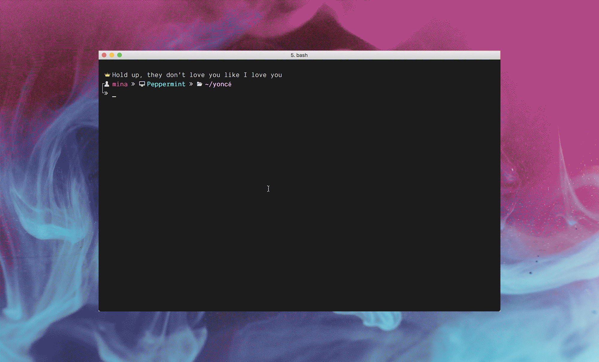
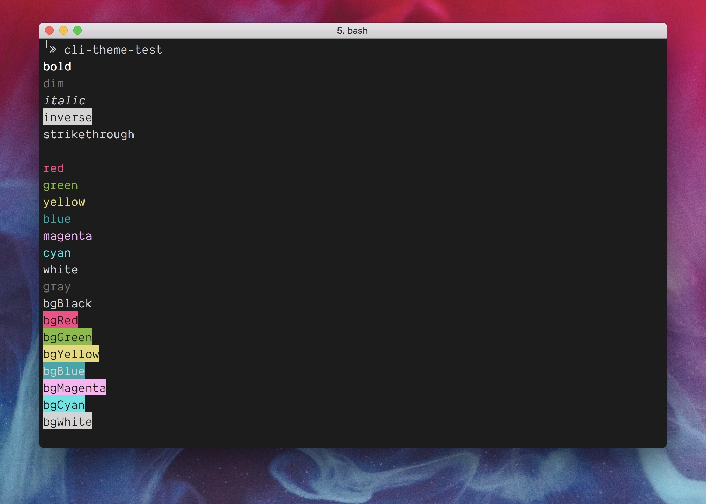
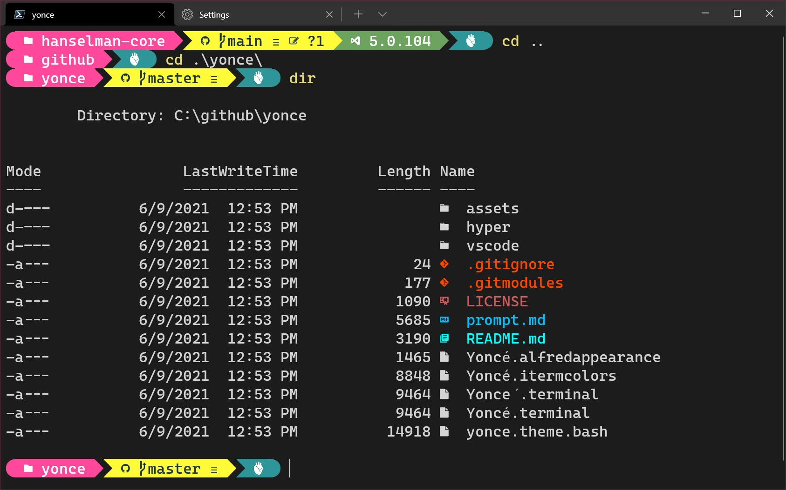
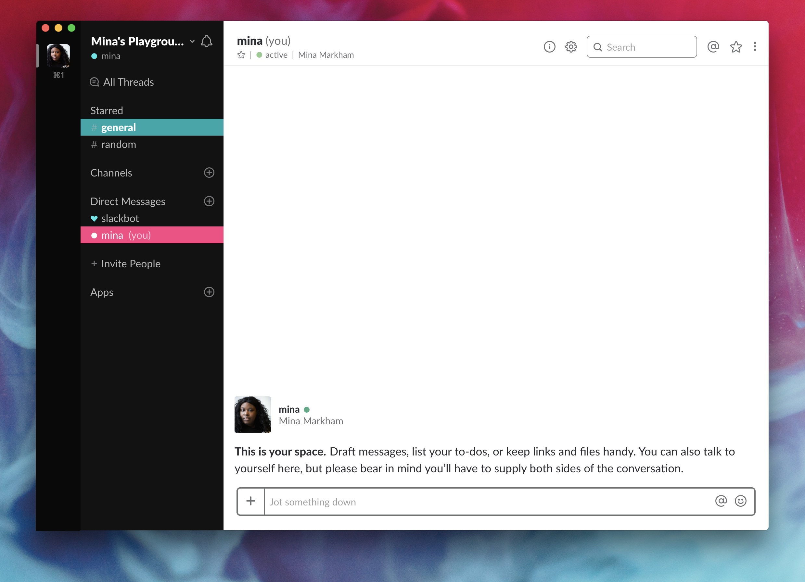
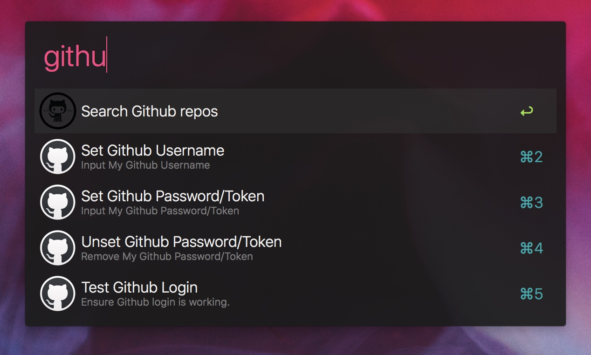

A Queen Bey inspired theme for [Bash-It](https://github.com/Bash-it/bash-it), [Visual Studio Code](http://code.visualstudio.com/), [iTerm](http://www.iterm2.com/), [Hyper](https://hyper.is/), [Slack](http://slack.com/), [Alfred](https://alfredapp.com) and more!

## Bash

_In order for this theme to render correctly, you will need a [Nerd Fonts-patched font](https://github.com/ryanoasis/nerd-fonts). Demo uses patched version of [Dank Mono](http://dank.sh)._

### Activating

1. Move [`yonce.theme.bash`](yonce.theme.bash) file to [bash-it](https://github.com/Bash-it/bash-it)'s theme folder: `.bash_it/themes/yonce/`.
2. Go to your `~/.bash_profile` file and set `BASH_IT_THEME="yonce"`.
3. Finally, reload your terminal.

_[Yoncé theme documentation](prompt.md)_  
_[Bash-it theme documentation](https://github.com/Bash-it/bash-it#themes)_

---

## Visual Studio Code

1. Install using Command Palette
2. Go to View -> Command Palette or press <kbd>⌘</kbd><kbd>Shift</kbd><kbd>P</kbd> / <kbd>Ctrl</kbd><kbd>Shift</kbd><kbd>P</kbd>
3. Then enter Install Extension
4. Write `Yonce`
5. Select it or press Enter to install

---

## Command prompt color schemes

### iTerm

1. iTerm2 → `Preferences` → `Profiles` → `Colors` Tab
2. Click `Load Presets...`
3. Click `Import...`
4. Select the [`Yoncé.itermcolors`](Yoncé.itermcolors) file
5. Select the `Yoncé` from `Load Presets...`

### Hyper

Add `hyper-yonce` to the plugins list in your `~/.hyper.js` config file.

### macOS Terminal

1. Terminal → `Preferences` → `Profiles` tab
2. Click the `Settings` (gear) icon
3. Click `Import...`
4. Select the [`Yoncé.terminal`](Yoncé.terminal) file

OR

1. Double-click on the [`Yoncé.terminal`](Yoncé.terminal) file to open a new Terminal window with the color scheme
2. Terminal → Shell → `Use settings as default`

**Note: Yoncé color scheme files reflects only the theme colors in the command prompt. To get the formatting and glyphs shown, you will need to configure your Bash theme via the instructions above.**

---

### Windows Terminal

From Windows Terminal, press Ctrl+,, then click Open JSON file at the lower right corner.

There is a JSON array of schemes in the settings.json. Paste the contents of "yonce.wintermcolors" at the end of that array. (There will be an import feature very soon)

* If you're using PowerShell, Yoncé looks amazing with [OhMyPosh.dev](http://www.OhMyPosh.dev) as well as [PSColors](https://www.hanselman.com/blog/you-should-be-customizing-your-powershell-prompt-with-psreadline) and [Terminal-Icons](https://www.hanselman.com/blog/take-your-windows-terminal-and-powershell-to-the-next-level-with-terminal-icons)

---

## Slack

### Activating

1. Open Preferences by clicking on your workspace name
2. Select Sidebar
3. Click the “customize your theme and share it with others” link
4. Paste `#121212,#2F2F2F,#FC4384,#FFFFFF,#00A7AA,#FFFFFF,#37E5E7,#A06FCA`
5. Click `X` button in upper right.

---

## Alfred

### Activating

Double-click on [`Yoncé.alfredappearance`](Yoncé.alfredappearance).

## Credits

* Background Photo by [Ruvim Noga](https://unsplash.com/photos/pazM9TQJ2Ck) on [Unsplash](https://unsplash.com/@ruvimnogaphoto)
